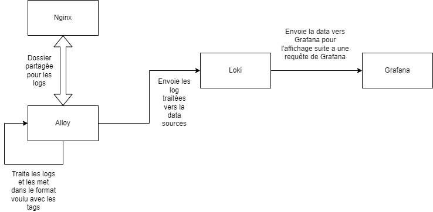
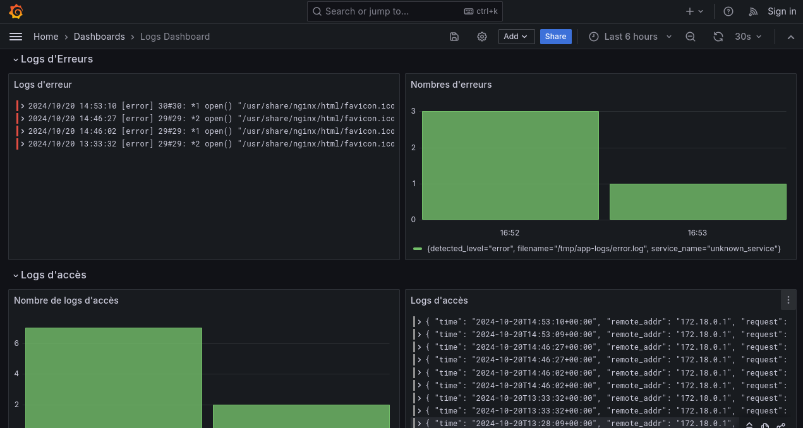

# Sae51-2 - Guide d'utilisation et de fonctionnement

## Rappel de l'objectif

Produire un Dockerfile/Docker-compose qui met un oeuvre une situation simple de collecte de logs, basée sur une des solutions existantes.Cela permet de visualiser et de filtrer les logs, comme les erreurs ou les requêtes HTTP, de manière centralisée.

## Description

Pour ce projet, nous avons opté pour la stack Grafana, Loki et Alloy. Pourquoi ? Parce que c'est l'outil le plus simple à prendre en main et qu'il répond parfaitement à nos besoins actuels ainsi qu'à nos connaissances. Il nous permet de centraliser nos logs rapidement et efficacement, sans avoir à nous plonger dans des configurations complexes.
De plus, nous avons mis en place un docker Nginx afin de traiter et visualiser les logs de ce serveur Nginx.

## Fonctionement

Notre docker-compose lance 4 dockers dont leur rôle est:
* Grafana est utilisé pour visualiser les logs via un tableau de bord.
* Loki stocke les logs et les expose à Grafana.
* Alloy est configuré pour collecter les logs de fichiers locaux et les envoyer à Loki.
* Un serveur Nginx génère des logs qui sont collectés et analysés.

Afin de mieux comprendre, voici un schéma de leur fonctionnement :



## Mise en place
### Prérequis

Pour tester cette configuration, vous aurez besoin de :

* Docker et Docker Compose installés sur votre machine.
  S'ils ne sont pas installés sur votre machine, effectuez les commandes suivantes :
  ``sudo apt install docker`` et ``sudo apt install docker-compose``.
* Un clone du projet avec les fichiers de configuration pour Grafana, Loki, Alloy, et Nginx ou bien le fichier Zip de ce projet.

### Démarrage du projet
1. Cloner le projet :
   ```
   git clone https://github.com/votre-repo/monitoring-stack.git
   cd Sae51-2
   ```
2. Vérifier que le service docker-compose soit actif:
   ```
   systemctl status docker-compose
   ```   
3. Lancer le Docker-compose :
   ```
   docker-compose up -d
   ```   
4. Accéder à l'interface Grafana :

   Une fois que les conteneurs sont en marche (Cela peut prendres quelques secondes), vous pouvez accéder à Grafana via votre navigateur à l'URL suivante :
   ```
   http://localhost:3000
   ```   
5. Visualisation des logs dans Grafana :

  Afin de voir les logs, il vous suffit juste d'ouvrir le menu, de se rendre dans la categorie Dashboard et de choisir (en cliquant dessus) le dashboard intitulé "Logs Dashboard". Vous voila sur la page de supervision des logs

6.  Générer les premiers logs:

     Afin de faire augmenter les logs, rendez-vous sur la page suivante:
    ```  
    http://localhost:8080
    ```  
    Et retourner sur le dashboard pour voir les nombres augmenter.

## Ce que vous êtes censé voir à l'exécution
Lorsque le projet est en marche, vous devriez observer les logs du serveur Nginx (qui sont générés lors de requêtes HTTP) dans Grafana. Cela inclut :

* Les requêtes HTTP traitées par Nginx (par exemple, les GET ou POST).
* Les erreurs potentielles (par exemple, les erreurs 404 ou 500).

Ainsi, une fois le docker-compose lancé et que l'on s'est rendu sur le dashboard, nous obtenons cela:



## Points clés du projet
* Ce qui a bien fonctionné :
  * Fichier de configuration : Grace au travail préparatoire et a de multiples recherche, les fichiers de configuration on été facile a été écrire et comprendre
  * Visualisation des erreurs et niveaux de logs : L'ajout de labels personnalisés comme level permet de trier et visualiser efficacement les erreurs critiques dans l'interface de Grafana.

* Problèmes rencontrés :
  * Configuration des volumes : Lors de la configuration des volumes, il a fallu s'assurer que les chemins montés entre Docker et l'hôte étaient corrects. Les erreurs de montage pouvaient empêcher Alloy de lire les logs Nginx.
  * Intégration de Grafana avec Loki : A cause du problèmes de configuration des volumes, nous avons passer beaucoup de temps a faire en sorte que Loki soit reconnu par défaut comme Datasources
  * Dashboard intégré: N'ayant pas beaucoup de documentation en ligne concernant les dashboard intégré lors du lancement de docker-compose, nouis avons eu des difficultés a trouver le formats afin que les dashboards soient fonctionnel.
## Test supplémentaire :
Vous pouvez générer des logs supplémentaires en effectuant des requêtes vers le serveur Nginx via votre navigateur ou en utilisant un outil comme curl.
   ```
   curl http://localhost:8080
   ```   
