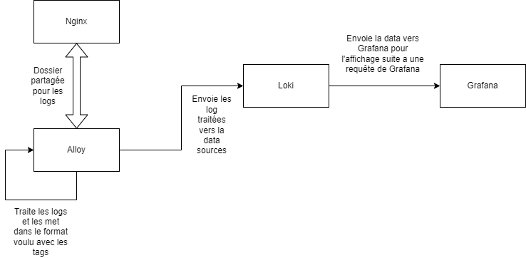

# Sae51-2 - Guide d'utilisation et de fonctionnement

## Rappel de l'objectif

Produire un Dockerfile/Docker-compose qui met un oeuvre une situation simple de collecte de logs, basée sur une des solutions existantes.Cela permet de visualiser et de filtrer les logs, comme les erreurs ou les requêtes HTTP, de manière centralisée.

## Description

Pour ce projet, nous avons opté pour la stack Grafana, Loki et Alloy. Pourquoi ? Parce que c'est l'outil le plus simple à prendre en main et qu'il répond parfaitement à nos besoins actuels ainsi qu'à nos connaissances. Il nous permet de centraliser nos logs rapidement et efficacement, sans avoir à nous plonger dans des configurations complexes.
De plus, nous avons mis en place un docker Nginx afin de traiter et visualiser les logs de ce serveur Nginx.

## Fonctionement

Notre docker-compose lance 4 dockers dont leur rôle est:
* Grafana est utilisé pour visualiser les logs via un tableau de bord.
* Loki stocke les logs et les expose à Grafana.
* Alloy est configuré pour collecter les logs de fichiers locaux et les envoyer à Loki.
* Un serveur Nginx génère des logs qui sont collectés et analysés.

Afin de mieux comprendre, voici un schéma de leur fonctionnement :



## Mise en place
### Prérequis

Pour tester cette configuration, vous aurez besoin de :

* Docker et Docker Compose installés sur votre machine.
  S'ils ne sont pas installés sur votre machine, effectuez les commandes suivantes :
  ``sudo apt install docker`` et ``sudo apt install docker-compose``.
* Un clone du projet avec les fichiers de configuration pour Grafana, Loki, Alloy, et Nginx ou bien le fichier Zip de ce projet.

### Démarrage du projet
1. Cloner le projet :
   ```
    git clone https://github.com/votre-repo/monitoring-stack.git
    cd Sae51-2
   ```
2. Vérifier que le service docker-compose soit actif:
   ```
    systemctl status docker-compose
   ```   
3. Lancer le Docker-compose :
   ```
    docker-compose up -d
   ```   
4. 
